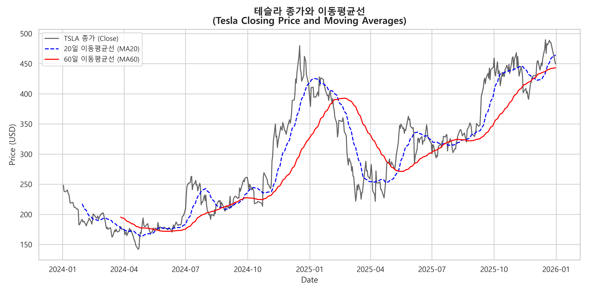
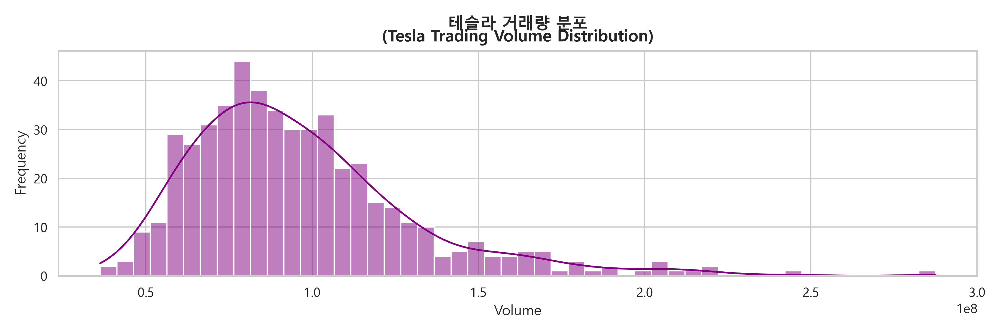
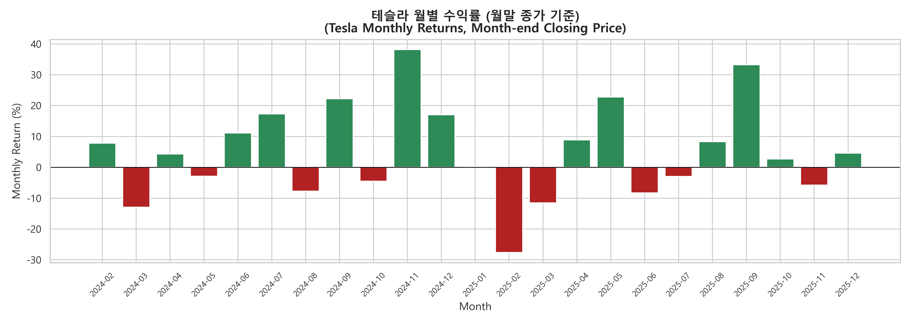
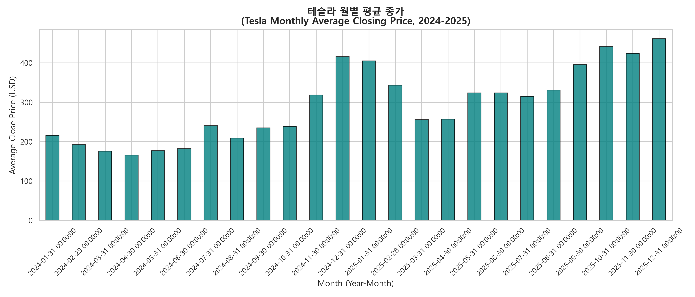
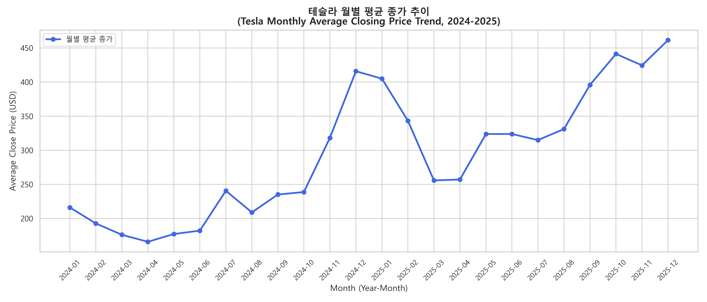
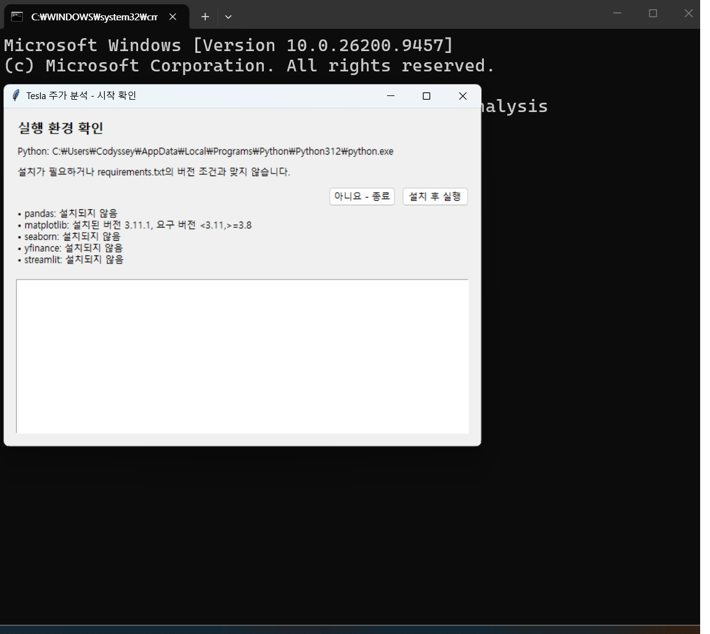
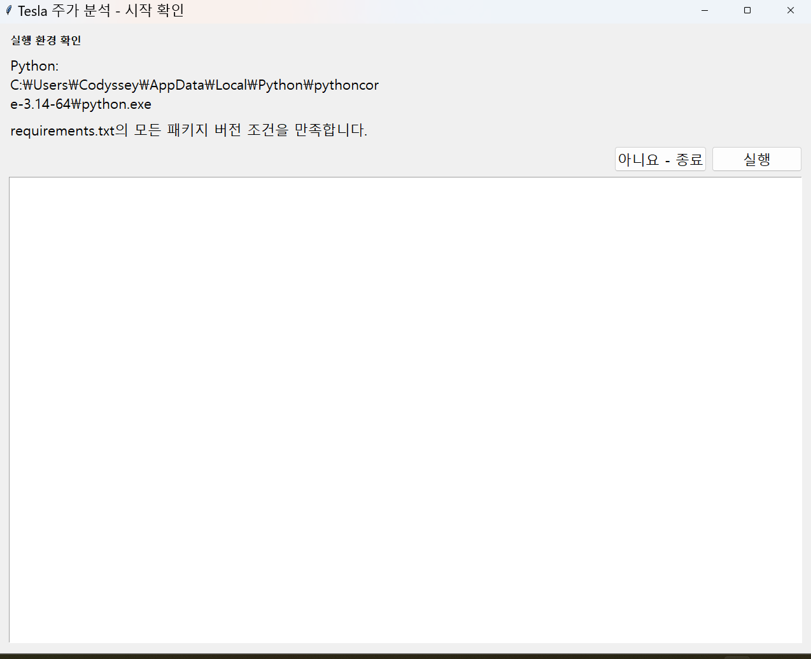
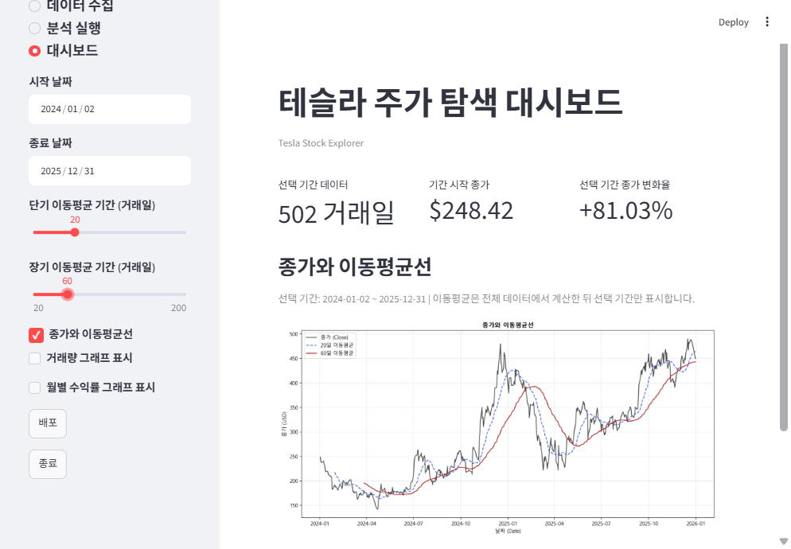
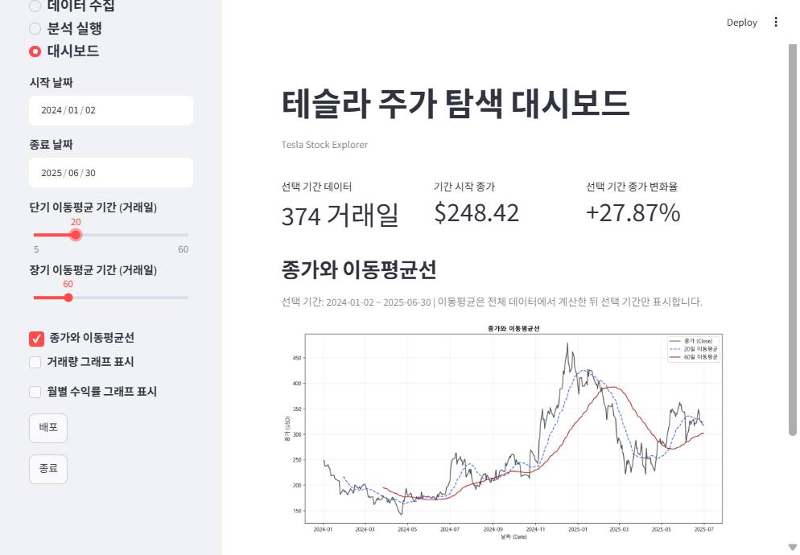
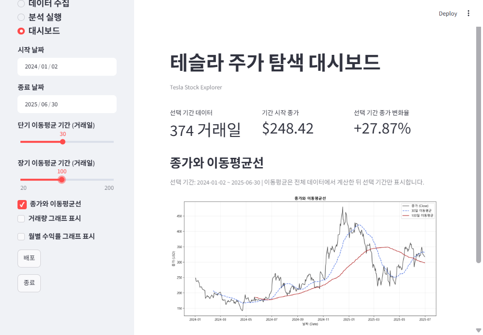

<h1 align="center">Tesla (TSLA) Stock Analysis</h1>
<p align="right">과제 제출자 : 신 재 풍</p>

## 1. 배포물 제출서 : ( 분석 결과 한눈에 보기 )

### (1) 분석 기간 : 2024-01-02~2025-12-31  

### (2) 데이터 : 502 거래일

- 첫 거래일 종가 **$248.42** → 마지막 거래일 종가 **$449.72** (**+81.03%**)
- 최고 종가 **$489.88** (2025-12-16) · 최저 종가 **$142.05** (2024-04-22)
- 월별 수익률: 상승 **14개월**, 하락 **9개월** · 최고 **+38.15%** (2024년 11월), 최저 **-27.59%** (2025년 2월)
- 연환산 변동성 **63.50%**

아래 분석 그래프를 바로 확인할 수 있습니다.  
상세 방법과 한계는 [분석 보고서](REPORT.md)에 정리했습니다.

### (3) 종가와 이동평균선



### (4) 거래량 분포



### (5) 월별 수익률



### (6) 월별 평균 종가





🟥 (주의) 과거 주가 자료에 대한 교육용 분석이며 미래 수익이나 투자 결과를 보장하지 않습니다.


## 2.  주가 분석 프로그램 설명서

### (1) 대상 : Tesla (TSLA) 주가 뷴석
테슬라(TSLA) 2024~2025년 주가 데이터를 수집하고, 이동평균·월별 수익률·변동성을 분석하는 교육 과제입니다.  
Streamlit 대시보드에서 기간과 이동평균 조건을 바꿔가며 결과를 탐색할 수 있습니다.

### (2) 준비 사항

- Python 3.10 이상
- 인터넷 연결 (Yahoo Finance에서 데이터를 처음 수집할 때 필요)

### (3) Windows 환경에서 
```
python main.py 명령어로 시작합니다.
```
### 시작 확인 창 (1의 경우) :  

### 시작 확인 창 (2의 경우) :  


1️⃣ 처음 시작은 main.py 자동실행 파일을 입력합니다.  
2️⃣ 그러면 작은 박스가 나타나는 데, 이것을 "시작 확인 창"이라고 부르겠습니다.  
3️⃣ 이 "시작 확인 창"에는 Python 환경과 패키지 상태가 표시됩니다.  
4️⃣ 패키지가 없거나 요구 버전과 맞지 않으면 **설치 후 실행**을 선택해서 설치할 수 있고,  
5️⃣ 이미 조건이 만족할 때는 **실행**을 선택하면 준비과정이 자동적으로 실행됩니다.  
6️⃣ 이제 앱이 열리면 왼쪽 **메인 메뉴**에서 과제를 진행합니다.

- **홈**: 실행 순서와 데이터 준비 상태를 확인합니다.
- **데이터 수집**: Yahoo Finance에서 TSLA 데이터를 내려받습니다.
- **분석 실행**: 기본 분석, 월별 분석, 요약 리포트를 차례대로 생성합니다.
- **대시보드**: 날짜·이동평균 조건을 조정하고 거래량·월별 수익률 그래프 표시를 선택합니다.  
               `종가와 이동평균선` 항목은 그래프 표시 선택 위에 표시됩니다.
- **배포**: 대시보드의 월별 수익률 표시 항목 아래에 있는 배포 버튼을 누르면 온라인 배포 안내를 확인할 수 있습니다.
- **종료**: 사이드바 맨 아래의 종료 버튼을 누르면  
            브라우저 화면을 닫고 Streamlit 서버를 정상 종료해 PowerShell 프롬프트로 돌아갑니다.


### (4) 프로젝트 구성

```text
tesla-stock-analysis/
├── analysis.py                 # 데이터 확인, 이동평균·월별 수익률, 그래프 생성
├── collect_data.py             # Yahoo Finance에서 TSLA 데이터 수집
├── monthly_analysis.py         # 월별 평균 종가 막대 그래프
├── monthly_line_chart.py       # 월별 평균 종가 선 그래프
├── summary_report.py           # 요약 통계 텍스트 출력
├── main.py                     # 환경 확인·필요한 패키지 설치·메인 메뉴 앱 실행
├── streamlit_app.py            # 기간·이동평균 조건을 바꿀 수 있는 대시보드
├── requirements.txt            # Python 패키지와 버전
├── REPORT.md                   # 분석 질문, 결과, 해석, 한계점, AI 사용 로그
├── data/                       # 데이터 수집 시 CSV가 저장되는 폴더
└── images/                     # 분석 그래프와 대시보드 캡처
```

### (5) 데이터 출처 및 이용 시 주의

`collect_data.py`는 Yahoo Finance에서  
TSLA의 2024-01-01 이상, 2026-01-01 미만 데이터를 받아 `data/tesla_stock_data.csv`로 저장합니다.  
🟥 수집 시점이나 제공처의 변경에 따라 데이터가 달라질 수 있습니다.  
🟥 데이터를 재배포하거나 상업적으로 이용하기 전에 Yahoo Finance의 최신 이용 약관을 확인하세요.

CSV 원본은 저장소에 포함하지 않습니다. 복제한 뒤 위 실행 방법대로 `python collect_data.py`를 실행해 생성하세요.

## 3. 대시보드 보너스 과제 (캡처)

아래 대시보드 화면 캡처 3개를 `images/` 폴더에 포함했습니다. 설정에 따른 화면 변화를 확인할 수 있습니다.

**기본 기간 · MA20/MA60**



**종료 날짜 2025-06-30 · MA20/MA60**



**종료 날짜 2025-06-30 · MA30/MA100**



## 재현 관련 참고

분석 기간은 CSV의 실제 관측 범위인 2024-01-02~2025-12-31이며 총 502 거래일입니다.  
분석 방법, 수치 근거, 그래프와 한계점은 [REPORT.md](REPORT.md)를 참고하세요.
